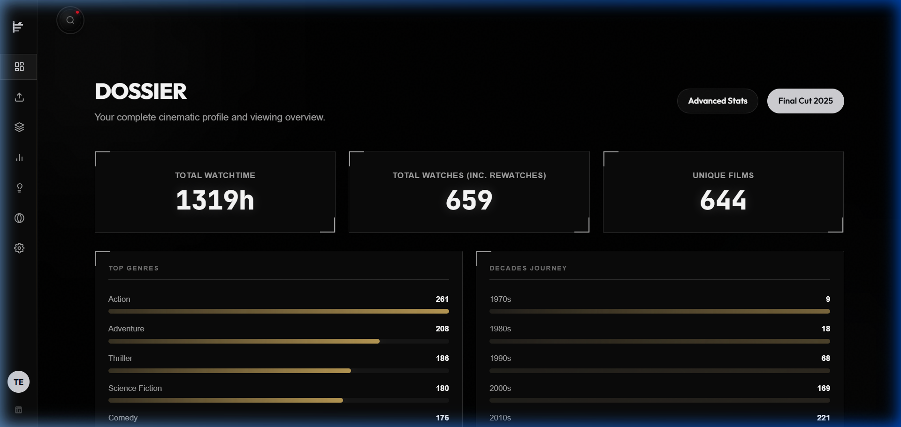
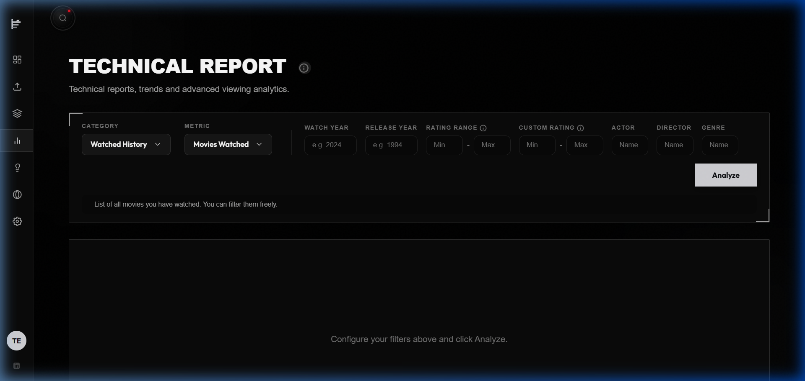
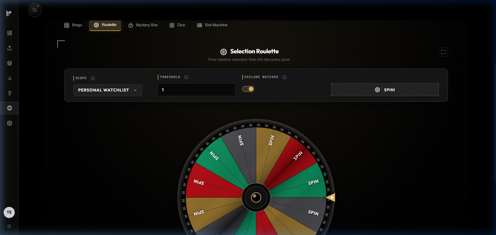
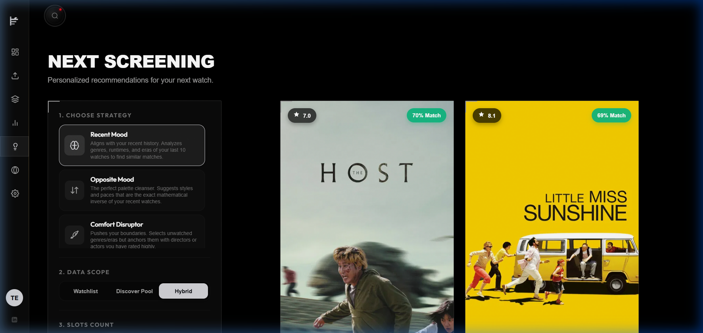

# Frametric

[](https://img.pages.dev)
[](LICENSE)
[](https://dotnet.microsoft.com/en-us/download/dotnet/9.0)
[](https://angular.dev)

**Frametric** is a premium cinematic intelligence platform and decision-fatigue mitigation suite. It transforms flat, personal viewing activity archives into rich data analytics, interactive movie detail landscapes, and dynamic slideshow reviews.

* **Live Platform:** [https://frametric.pages.dev](https://frametric.pages.dev)
* **API Health Endpoint:** `https://frametric-api.onrender.com/api/v1/health`

---

## 1. Core Philosophy: Cinematic Data as Narrative

Frametric is **not** a Letterboxd clone. Instead, it acts as a centralized cinematic data engine. 

Most movie trackers focus on the micro-interactions of logging. Frametric treats aggregated history as a structured narrative canvas. It ingests, cleans, and normalizes heterogeneous movie logs, enriches them with global metadata databases, and serves high-performance analytics to mitigate decision fatigue through custom recommendation engines and playful discovery mechanics.

---

## 2. Platform Features

### 2.1. In-Memory Ingestion & Normalization
* **Zero-Disk Streaming:** Receives and extracts Letterboxd `.zip` archive exports in memory without intermediate disk writes.
* **Quirk Resolution:** Auto-corrects decimal formatting anomalies in year fields (e.g., `2022.0` in watchlist CSVs), translates textual rewatch flags to boolean matrices, and parses multi-line movie reviews containing embedded carriage returns.
* **Relational Deduplication:** Matches movies against unique external URI schemas (`ExternalReference` value objects) to link active logs to existing database catalog records, eliminating duplication.

### 2.2. Asynchronous Metadata Enrichment
* **Producer-Consumer Pipeline:** Built with `System.Threading.Channels`. On import completion, it signals a background Hosted Service to sweep pending titles.
* **TMDb Integration:** Fetches directors, genres, posters, runtimes, and primary cast members in background batches of 20.
* **Rate-Limit Resilience:** Throttles external API requests (10-second intervals) and maps unsuccessful search outcomes to `Failed` states to prevent redundant lookups.

### 2.3. Advanced Analytics & "The Final Cut"
* **Dapper SQL Read-Models:** Computes high-performance analytics, leaderboards, and rating evolution histograms.
* **Advanced Statistics Portal:** Provides users with server-side paginated grids supporting sorting (ARIA-compliant) and multi-dimensional filters (watch year, release decade, director, actor, genres, score range).
* **Cinematic Profiles:** High-fidelity detail views for Movies, Actors, and Directors—featuring scrolling poster backdrop murals, likes, watchlists, and unwatched counter indicators.
* **The Final Cut:** An interactive, projector-lit presentation displaying yearly metrics, bookends (first/last watches), rating extremes, and genre landscapes.


*Figure 1: Main dashboard layout presenting viewing volume, top genres, watch time, and cinematic era trends.*


*Figure 2: Advanced statistics panel showing tabular distributions, multi-column sorting, and cross-filtering.*

### 2.4. Decision-Fatigue Mitigation Suite (Playful Discovery)
* **Cinematic Roulette:** An SVG-rendered spinning movie reel with realistic pointer tick vibrations and decelerations to select random unwatched films.
* **Polyhedral Dice System:** Renders unique D3 (Duration), D4 (Rarity/Popularity), D6 (Risk), D12 (Quality), and D20 (Genre) SVG dice. If filters return no match, constraints relax in a round-robin loop, rendering the deviation on a HUD calibration banner.
* **3D Slot Machine:** Metal cabinet slot reels matching Genre, Decade, Director, Duration, and Country configurations, complete with lever animations and jackpot diagnostics.
* **Film Canisters:** Retro metallic canisters that pop open with animations to reveal mystery recommendations.
* **Cinematic Bingo:** Generates 3x3, 4x4, and 5x5 boards with custom cinephile challenges, dynamically evaluating user logs to mark squares as completed.


*Figure 3: Interactive selection tools (Roulette reel, Polyhedral Dice configuration, and 3D Slot Machine).*


*Figure 4: Tailored cinematic recommendations generated via clean, decoupled heuristic strategies.*

### 2.5. Admin Console & Diagnostics
* **System Operations Panel:** Secure administration views for User Management (search, filters, role promotion) and system maintenance (cache clearing, orphan purges).
* **Provider Diagnostics:** Real-time health validation and latency pings for the local PostgreSQL database, backend service, and external metadata providers.
* **Logs Ring Buffer:** In-memory ring buffer capturing the last 50 warning and error logs for quick live diagnostic checks.

---

## 3. Technology Stack

### Backend (.NET 9)
* **Modular Monolith:** Clean Architecture separation (`Domain`, `Application`, `Infrastructure`, `Api`).
* **CQRS Architecture:** Implemented via MediatR handlers with schema assertions handled by FluentValidation.
* **Data Access:** Entity Framework Core (transactional CRUD and migrations) paired with Dapper (high-speed analytical read-queries).
* **Communications:** REST API versioned under `/api/v1/` with auto-generated OpenAPI schemas.

### Frontend (Angular 19)
* **Standalone Structure:** Lightweight component compilation bypassing legacy `NgModule` declarations.
* **Signal-Based State:** Employs modern Angular Signals for high-performance reactive updates.
* **Auth Interceptors:** Appends JWT headers to outgoing requests and intercepts `401` states to run sliding refresh token renewals.

### Production Cloud Deployment
* **Client Host:** **Cloudflare Pages** hosting the compiled static SPA on the edge CDN, eliminating cold starts.
* **API Service:** Containerized via Docker and hosted as a Web Service on **Render**.
* **Database Engine:** Serverless PostgreSQL hosted on **Neon**.
* **Email System:** Transactional email flows (password reset pipelines) managed via **Resend** under the official domain **`@frametric.yxz`**.
* **CI/CD:** Automated builds, Vitest runs, and deployment workflows managed via **GitHub Actions**.

---

## 4. Developer Quick-Start Guide

### Prerequisites
* **Docker / Docker Desktop**
* **.NET 9.0 SDK**
* **Node.js (v18+) & npm**

### Step 1: Clone and Infrastructure Boot
Clone the repository and spin up the database stack:
```bash
git clone https://github.com/jeotma/Frametric.git
cd Frametric
docker-compose up -d
```

### Step 2: Database Migration Configuration
Apply the database migrations locally:
```bash
cd backend/Frametric.Api
dotnet ef database update --project ../Frametric.Infrastructure/Frametric.Infrastructure.csproj
```

### Step 3: Run the Backend API
Start the .NET Web API locally:
```bash
dotnet run
# The API will be active under http://localhost:5000 and https://localhost:5001
# View Swagger API docs at: https://localhost:5001/swagger/index.html
```

### Step 4: Run the Frontend Client
Navigate to the frontend folder, download schemas, and boot the Angular development server:
```bash
cd ../../frontend
npm install

# Download OpenAPI spec and generate TypeScript client models
npm run download:spec
npm run generate:api

# Boot Angular local server
npm start
# The client will be active at http://localhost:4200/
```

---

## 5. Testing Reference

Frametric employs a strict testing pyramid verifying the codebase:

* **Unit & Integration Tests (xUnit / Moq):** Verifies business logic, parsers, and command/query handlers.
  ```bash
  cd backend
  dotnet test
  ```
* **Client-Side Unit Tests (Vitest):**
  ```bash
  cd frontend
  npm run test
  ```
* **End-to-End Tests (Playwright):** Validates full workflows (signup, login, ZIP import, dice rolling, bingo evaluations):
  ```bash
  cd frontend
  npx playwright install
  npm run e2e
  # View test run UI: npm run e2e:ui
  ```

---

## 6. Architecture & Directory Overview

```text
Frametric/
 ├── .github/workflows/          # CI/CD GitHub Actions pipelines
 ├── docs/                       # Technical Specifications & Roadmap Docs
 │    ├── api/                   # REST API specification mapping
 │    ├── architecture/          # Modules, Processing, and Engine details
 │    ├── database/              # Entity structures and Mermaid ERD
 │    └── requirements/          # MVP v1 and MVP v2 definitions
 ├── frontend/                   # Angular 19 Client SPA
 │    ├── src/app/core/          # Global services, interceptors, and generated API
 │    ├── src/app/features/      # Lazy-loaded views (stats, discovery, final-cut)
 │    └── playwright/            # E2E test suites
 └── backend/                    # .NET 9 Modular Monolith
      ├── Frametric.Api/         # Minimal controllers and HTTP routing
      ├── Frametric.Application/ # CQRS command/query handlers and DTOs
      ├── Frametric.Domain/      # Relational entities and external reference values
      └── Frametric.Infrastructure/# DbContext, Dapper, CSV parsers, Background workers
```

For detailed specifications, see:
* [TechnicalArchitectureAndProjectPlanning.md](file:///C:/Users/JJ/Documents/PersonalProjects/Frametric/docs/TechnicalArchitectureAndProjectPlanning.md)
* [endpoints.md](file:///C:/Users/JJ/Documents/PersonalProjects/Frametric/docs/api/endpoints.md)
* [domain-model.md](file:///C:/Users/JJ/Documents/PersonalProjects/Frametric/docs/database/domain-model.md)
* [recommendation-strategies.md](file:///C:/Users/JJ/Documents/PersonalProjects/Frametric/docs/architecture/recommendation-strategies.md)
* [mvp_v2.md](file:///C:/Users/JJ/Documents/PersonalProjects/Frametric/docs/requirements/mvp_v2.md)
