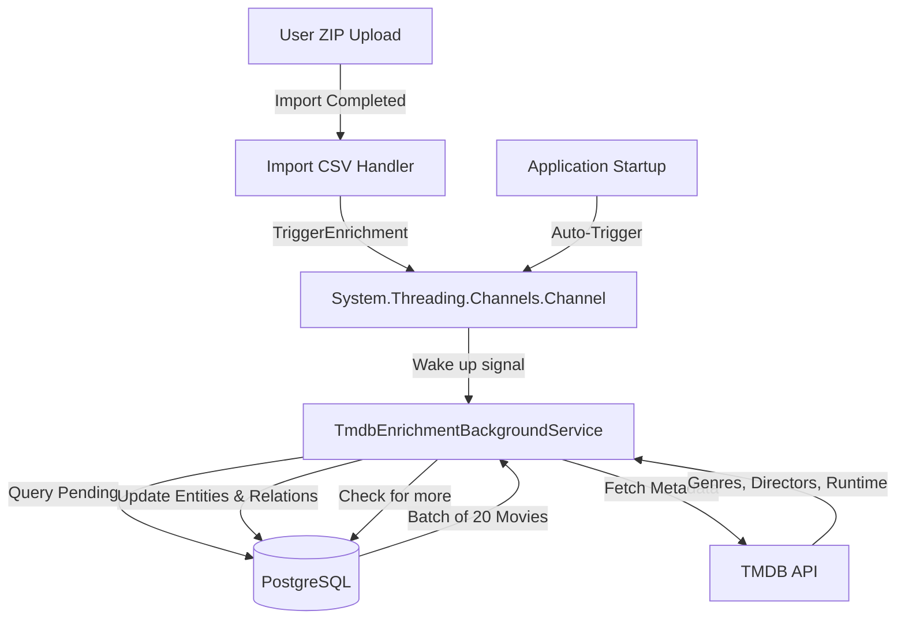

# Background Processing Architecture

Frametric employs an asynchronous background worker pipeline to enrich movies with metadata from external APIs (such as TMDB) without impacting client-facing transaction performance.

## Architecture Overview

Rather than relying on resource-intensive periodic polling or heavy external orchestration tools like Hangfire/Quartz.NET, Frametric implements a lightweight, in-memory **Producer-Consumer** queue using `System.Threading.Channels`.

---

## Component Breakdown

### 1. `ITmdbEnrichmentTrigger` & `TmdbEnrichmentTrigger`

Located in `Frametric.Infrastructure/BackgroundJobs/TmdbEnrichmentTrigger.cs`.

- **Purpose**: Exposes an interface to signal the background service that new movies need enrichment.
- **Channel Design**: Uses a bounded channel of size 1 with `BoundedChannelFullMode.DropOldest`.
  - Since the trigger only needs to convey a single state change ("there are pending movies"), subsequent trigger calls before the worker starts reading will simply discard older duplicate signals to avoid redundant wake-ups.

### 2. `TmdbEnrichmentBackgroundService`

Located in `Frametric.Infrastructure/BackgroundJobs/TmdbEnrichmentBackgroundService.cs`.

- **Inheritance**: Inherits from `Microsoft.Extensions.Hosting.BackgroundService`.
- **Execution Flow**:
  1. On application startup, it immediately signals the trigger so that any pending movies from crashed/interrupted previous sessions are automatically picked up.
  2. It asynchronously reads from the trigger channel using `ReadAllAsync(stoppingToken)`.
  3. Upon receiving a trigger, it enters a processing loop:
     - Spawns a scope and resolves `IMediator`.
     - Sends `EnrichPendingMoviesCommand` requesting a batch size of **20** movies.
     - If movies were enriched, it logs progress and waits for **10 seconds** (`Task.Delay`) to respect TMDB API rate limit policies.
     - If no more pending movies are found, it sends `MarkImportsCompletedCommand` to transition import batches from `Enriching` to `Completed`, then breaks the inner loop to sleep until the next channel write.
- **Resilience**: If an exception occurs, the service logs the error, waits for **30 seconds**, and continues to prevent crash-looping.

---

## State Transition Lifecycle

During the pipeline run, the state of the entities changes as follows:

1. **ZIP Ingestion**:
   - `Movie` entities are created with `EnrichmentStatus = Pending`.
   - `ImportHistory` records are created with `Status = Enriching`.
2. **Background Processing**:
   - Movie metadata (Poster URL, Runtime) is fetched from TMDB.
   - Cast, Directors, and Genres relationships are mapped and saved.
   - `Movie.EnrichmentStatus` is updated to `Completed` (or `Failed` if TMDB query yields no results).
3. **Completion**:
   - When the worker retrieves a batch count of `0` pending movies, it fires `MarkImportsCompletedCommand`.
   - All `ImportHistory` batches currently in `Enriching` state are transitioned to `Success`.
