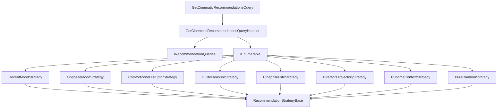

# Recommendation Engine Architecture & Algorithmic Design

This document details the architecture, mathematical formulations, and algorithmic models powering the Frametric Cinematic Recommendation Engine.

---

## 1. Architectural Decoupling (Strategy Pattern)

The recommendation subsystem is designed using the **Strategy Pattern** to keep the core query handler loosely coupled to the individual algorithmic models.

- **`IRecommendationStrategy`**: Represents the common contract for all recommendation algorithms.
- **`RecommendationStrategyBase`**: An abstract base class providing reusable mathematical computations, rating aggregators, and tie-breakers.
- **`GetCinematicRecommendationsQueryHandler`**: Coordinates cache checks, fetches the media pool (watchlist, database, or hybrid), and delegates selection to the registered strategy corresponding to the request.

---

## 2. Core Heuristics & Mathematical Models

### Cosine Similarity over Temporal-Decayed Preferences

For vector alignment in content-based filtering (such as **RecentMood** and **OppositeMood**), preference vectors are built using an exponential decay model:

$$w_i = r_i \cdot e^{-\lambda \cdot t_i}$$

Where:

- $r_i$ is the normalized user rating weight for watch $i$ (ranging from $0.1$ to $1.0$, defaulting to $0.7$ for unrated).
- $t_i$ is the time delta (in days) between watch $i$ and the user's latest logged diary entry.
- $\lambda$ is the decay constant computed from a half-life of 45 days: $\lambda = \frac{\ln(2)}{45}$.

The similarity score between the user profile vector $\mathbf{U}$ and candidate movie vector $\mathbf{C}$ is calculated using the **Cosine Similarity**:

$$\text{Sim}(\mathbf{U}, \mathbf{C}) = \frac{\mathbf{U} \cdot \mathbf{C}}{\|\mathbf{U}\| \|\mathbf{C}\|} = \frac{\sum U_j C_j}{\sqrt{\sum U_j^2} \sqrt{\sum C_j^2}}$$

### Bayesian Rating Aggregator

To stabilize rating metrics across multiple sources (TMDb, IMDb, Metacritic, Rotten Tomatoes, and internal custom ratings) and prevent entries with a single high rating from dominating the feed:

$$\text{Rating}_{\text{Bayesian}} = \frac{v \cdot R + m \cdot C}{v + m}$$

Where:

- $v$ is the number of rating sources available for the movie.
- $R$ is the weighted average of the raw ratings (giving custom ratings a $2.5\times$ weight).
- $m$ is the prior confidence weight (set to $2.0$).
- $C$ is the global prior mean rating (set to $6.5$).

### The Uniqueness Tie-Breaker

To prevent matching percentage collisions and guarantee that no two movies share the exact same score representation in lists, a tie-breaker offset is appended:

$$\text{Score}_{\text{Final}} = \text{Score}_{\text{Base}} + \Delta_{\text{TieBreaker}}$$

$$\Delta_{\text{TieBreaker}} = (\text{Popularity}_{\text{TMDb}} \times 10^{-6}) + (\text{Rating}_{\text{Global}} \times 10^{-5}) + (\text{Hash}_{\text{MovieID}} \bmod 10000 \times 10^{-7})$$

This creates a high-precision decimal tail that enforces a deterministic sorting order while preserving readability.

---

## 3. Algorithmic Matrix Overview

| Strategy | Primary Metric | secondary Penalties/Bonuses |
| --- | --- | --- |
| **RecentMood** | Cosine Similarity of genres & keywords | Decadal matching, runtime alignment, director/actor overlaps. |
| **OppositeMood** | $1 - \text{Cosine Similarity}$ (genre distance) | Switch of mood poles (Reflective $\leftrightarrow$ Action), inverted runtimes/decades. |
| **ComfortZoneDisruptor** | Dissimilarity to comfort zones (genres/eras $>25\%$ share) | Familiarity anchors (highly rated actors/directors/writers from user history). |
| **GuiltyPleasure** | High audience score vs critic review divergence | Low global popularity, niche highly rated genre match, no major awards wins. |
| **CinephileElite** | Weighted prestige index (RT/Metacritic/IMDb/TMDb) | Academy Award wins/nominations, foreign/intl country status, longer runtime. |
| **DirectorsTrajectory** | High user rating index for director ($\ge 7.5$) | Chronological release progression, writer/director auteur alignment. |
| **RuntimeContext** | Runtime distance to user availability slot | Pacing index matching runtime limits (high tempo genres for short limits). |
| **PureRandom** | Random selection | Micro-fractional tie-breaker offsets to guarantee duplicate elimination. |
