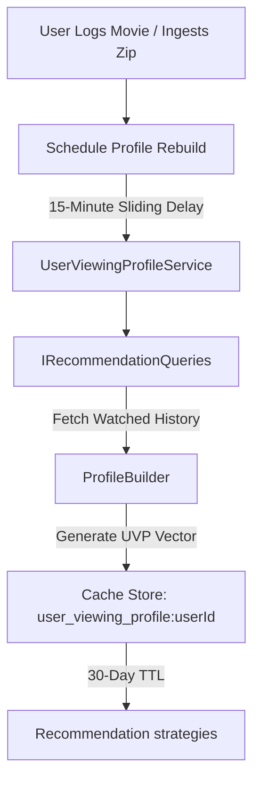

# User Viewing Profile (UVP) Specification

This document details the architecture, data structures, and lifecycle of the **User Viewing Profile (UVP)** subsystem. The UVP is the core component that models a user's cinematic taste vector, driving the heuristic algorithms of the recommendation engine.

---

## 1. Architectural Concept

The User Viewing Profile is an aggregated taste model representing a user's historical interaction with cinema. Instead of calculating preferences dynamically on every recommendation request, the system models tastes as a semi-static, cached profile.

---

## 2. UVP Data Structure

The `UserViewingProfile` class encapsulates preference frequency weights and statistical means:

### Preference Vector Fields
* **`Genres`** (`Dictionary<string, double>`): Normalized preference score per genre based on watch counts and user ratings.
* **`Directors`** (`Dictionary<string, double>`): Normalized preference score per director.
* **`Actors`** (`Dictionary<string, double>`): Normalized preference score per lead actor.
* **`Writers`** (`Dictionary<string, double>`): Normalized preference score per screenwriter.
* **`Keywords`** (`Dictionary<string, double>`): Frequency vectors of movie tags (e.g. "time travel", "dystopia").
* **`Decades`** (`Dictionary<int, double>`): Normalized affinity for different release eras (grouped by decade).
* **`Languages`** (`Dictionary<string, double>`): Language preferences (e.g., `"en"`, `"es"`, `"ja"`).
* **`Countries`** (`Dictionary<string, double>`): Production countries affinity.

### Cinematic Behavior Metrics
* **`PreferredRuntime`** (`double`): The mathematical mean of the runtime of films watched by the user (default: `100.0` minutes).
* **`AverageUserRating`** (`double`): The mean score given by the user across all rated films (default: `7.0`).
* **`TotalWatches`** (`int`): The total count of diary entries.
* **`AverageOscarWins` / `AverageOscarNoms` / `AverageOtherWins`** (`double`): Indicators of user's affinity for prestigious award-winning cinema.
* **`AverageBoxOffice`** (`double`): Mean box office earnings of watched films (indicates commercial blockbusters vs. indie preference).

---

## 3. Lifecycle & Cache Strategy

To optimize database response times, profiles are computed once and stored in the cache layer:

* **Caching Store:** Managed by `ICacheService` (using memory or distributed caching).
* **Cache Key:** `user_viewing_profile:{userId}`
* **TTL (Time to Live):** 30 days.

---

## 4. Asynchronous Rebuild & Sliding Window

When a user interacts with the platform (e.g., logging a new watch, liking a film, deleting a diary entry, or completing a Letterboxd import), their taste profile must be updated. To prevent database thrashing (for example, during a 1,000-movie ZIP import or back-to-back manual logging), the system uses a **Sliding Window Rebuild Schedule**:

1. **Scheduling a Rebuild:** The application triggers `IUserViewingProfileService.ScheduleRebuild(userId)`.
2. **Sliding Delay:** The service schedules the update to occur in exactly **15 minutes** in the future.
3. **Resetting the Window:** If the user logs another movie within those 15 minutes, the execution timestamp slides forward by another 15 minutes.
4. **Background Worker Processing:** The `UserViewingProfileService` (a Hosted `BackgroundService`) executes a check loop every **10 seconds**. Once the sliding time is reached and no new actions occur, the worker calls `RebuildProfileAsync` to regenerate the profile from the database and updates the cache.
