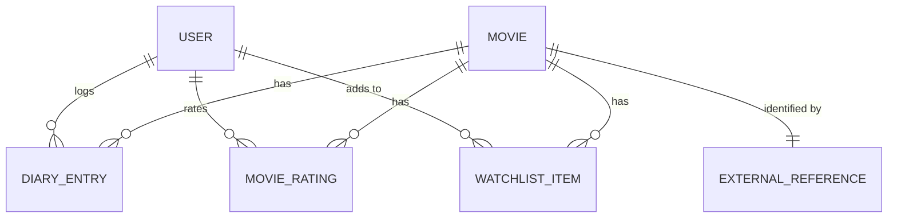

# Frametric Domain Model

This document outlines the core business entities within the `Frametric.Domain` layer. In accordance with Clean Architecture, these entities are completely isolated from infrastructure concerns (e.g., databases, external APIs, CSV files).

## Entity Relationship Diagram (ERD)

## Entities & Value Objects

### 1. User (Aggregate Root)

Represents the account interacting with the platform.

* `Id` (Guid)
* `Username` (string)
* `Email` (string)
* `CreatedAt` (DateTime)

### 2. Movie (Aggregate Root)

The pure representation of a cinematic piece. Note that external identifiers are kept separate from the core movie fields.

* `Id` (Guid)
* `Title` (string)
* `ReleaseYear` (int?)
* `ExternalReference` (Value Object)

### 3. ExternalReference (Value Object)

Used to identify entities across different external systems (e.g., Letterboxd, IMDb, TMDB) to allow for deduplication.

* `Source` (string) - e.g., "Letterboxd"
* `ExternalId` (string) - e.g., "<https://boxd.it/cVEBb5>"

### 4. DiaryEntry (Entity)

Represents a specific viewing event by a user.

* `Id` (Guid)
* `UserId` (Guid)
* `MovieId` (Guid)
* `LogDate` (DateOnly) - When the user logged it
* `WatchedDate` (DateOnly) - When the user actually watched it
* `Rating` (decimal?)
* `IsRewatch` (bool)
* `Tags` (string) - A normalized comma-separated string or a list.

### 5. MovieRating (Entity)

Represents a standalone rating, uncoupled from a specific viewing event.

* `Id` (Guid)
* `UserId` (Guid)
* `MovieId` (Guid)
* `DateRated` (DateOnly)
* `Score` (decimal)

### 6. WatchlistItem (Entity)

Tracks movies that the user intends to watch.

* `Id` (Guid)
* `UserId` (Guid)
* `MovieId` (Guid)
* `DateAdded` (DateOnly)
