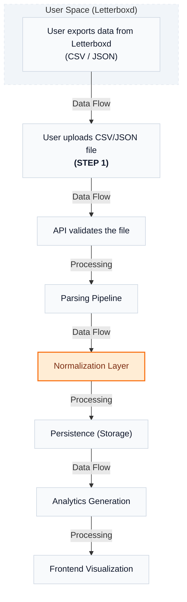

# Letterboxd Data Processing Flowchart

This flowchart outlines the sequential flow of data and processing steps when a user imports their Letterboxd data into Frametric.

```mermaid
flowchart TD
    %% Styling Definitions %%
    classDef default fill:#f8fafc,stroke:#cbd5e1,stroke-width:1px,color:#0f172a;
    classDef highlight fill:#ffedd5,stroke:#f97316,stroke-width:2px,color:#7c2d12;
    classDef container fill:#f1f5f9,stroke:#e2e8f0,stroke-width:1px,stroke-dasharray: 5 5;

    subgraph UserSpace ["User Space (Letterboxd)"]
        A["User exports data from Letterboxd<br/>(CSV / JSON)"]
    end
    class UserSpace container;

    B["User uploads CSV/JSON file<br/><b>(STEP 1)</b>"]
    C["API validates the file"]
    D["Parsing Pipeline"]
    E["Normalization Layer"]
    F["Persistence (Storage)"]
    G["Analytics Generation"]
    H["Frontend Visualization"]

    class E highlight;

    A -->|"Data Flow"| B
    B -->|"Data Flow"| C
    C -->|"Processing"| D
    D -->|"Data Flow"| E
    E -->|"Processing"| F
    F -->|"Data Flow"| G
    G -->|"Processing"| H
```
