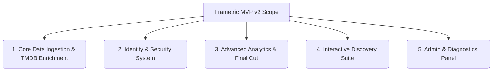

# MVP v2 — Cinematic Analytics Platform (The Expanded Vision)

## 1. Purpose and Overview

Following successive development phases, the Frametric platform has evolved from a simple batch-file parser into a comprehensive, interactive, and secured **Cinematic Analytics Platform**. 

This document (MVP v2) acts as the updated specification of the **actually implemented system**, documenting the expanded features, security architectures, advanced query analytics, and interactive discovery systems that are fully functional in the current codebase.

---

## 2. Core Features (Implemented)

### 2.1. Ingestion Pipeline & Background Enrichment
* **In-Memory ZIP Extraction:** Streams and parses Letterboxd export files (`diary.csv`, `ratings.csv`, `watched.csv`, `watchlist.csv`, `likes/films.csv`) entirely in memory without writing to disk.
* **Data Normalization:** Employs custom TypeConverters to cast decimal years (e.g. `2022.0` in watchlist) to integers, maps "Yes" to booleans, and bypasses metadata headers in custom list CSVs.
* **Producer-Consumer Enrichment Queue:** Leverages `System.Threading.Channels` on startup and after import cycles. It queries TMDB in background batches of 20 to fetch runtimes, posters, genres, directors, and top cast, throttling calls by 10 seconds to respect API limits.

### 2.2. Identity, Authentication & Security
* **JWT Authentication:** Stateful registration and login providing stateless JWT access tokens, supported by sliding-expiration refresh tokens stored in PostgreSQL.
* **Secure Password Recovery:** Implements a complete password reset pipeline using token verification and email dispatch via SMTP.
* **Session Persistence:** Keeps the Angular frontend authenticated by storing and updating tokens in `localStorage`, intercepting `401 Unauthorized` responses to auto-refresh access tokens transparently.

### 2.3. Advanced Analytics & "The Final Cut"
* **Dapper Optimization:** Implements dedicated, indexed SQL read-models to serve heavy aggregations.
* **Advanced Statistics Portal:** Provides cross-filtering parameters (watch year, release decade, genres, actors/directors, ratings) with server-side pagination, ARIA sorting, and sessionStorage state retention.
* **Entity Detail Pages:** Displays comprehensive filmographies, metrics (likes, watch counts, unwatched counts), and scrolling backdrop poster murals for Movies, Actors, and Directors.
* **The Final Cut:** Spotify Wrapped-style slide deck displaying yearly metrics using premium CSS dark-mode gradients and SVG icons.

### 2.4. Interactive Discovery Suite
* **Cinematic Roulette:** SVG-rendered spinning movie-reel wheel with realistic deceleration, selecting random movies with options like persistence thresholds. Supports a **Partner Mode** where two users' watchlists are merged; result cards indicate whether each film is in the current user's watchlist, the partner's watchlist, or both. Partner username is validated in real-time before spinning.
* **Polyhedral Dice System:** SVG-based D3 (Duration), D4 (Popularity), D6 (Risk), D12 (Quality), and D20 (Genre) rollers. If no exact candidate is found, constraints relax sequentially, returning a distance value that drives a HUD match calibration banner.
* **3D Slot Machine:** Curated reels (Genre, Decade, Director, Duration, Country) supporting manual overrides, metallic cabinet styling, and jackpot triggers.
* **Mystery Box Canisters:** Visual retro film canisters that pop open with animations (flying lids, shaking, poster emergence) to reveal movie suggestions.
* **Cinematic Bingo:** Grid boards (3x3, 4x4, 5x5) containing cinephile goals that evaluate diary entries and automatically mark objective squares as completed. Includes a retry/reroll objective counter.

### 2.5. Administrative & Diagnostics Suite
* **System Operations Panel:** Admin interface allowing administrative users to view user lists, search emails, promote users, and clear caches.
* **Provider & Database Diagnostics:** Latency check pings for the local PostgreSQL database, backend service, and external metadata APIs (TMDB, OMDb).
* **Logging Buffer:** High-fidelity in-memory ring buffer capturing the last 50 warning and error logs for live inspection.
* **Maintenance Utilities:** Commands to trigger manual metadata enrichment retries and purge orphaned actors/directors from the database.

---

## 3. Implemented Technical Stack

* **Backend Engine:** .NET 9 Web API with Clean Architecture layers (`Domain`, `Application`, `Infrastructure`, `Api`).
* **Persistence:** PostgreSQL (via Entity Framework Core for transactional migrations and Dapper for analytical queries).
* **Caching:** In-memory query caching via `IMemoryCache` for high-frequency stats.
* **Frontend Client:** Angular 19+ Single Page Application built on Standalone Components, Signal-based state management, lazy-routed feature sets, and OpenAPI auto-generated TS clients.
* **Testing Suite:** xUnit (unit & handler tests) and Playwright (E2E flows).
