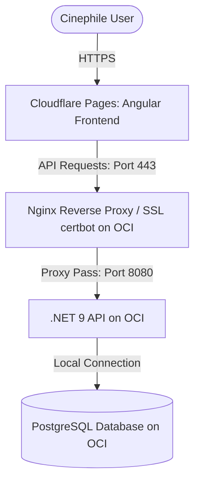

# Roadmap: Phase 7 (Migration to Oracle Cloud Infrastructure - Always Free VM)

This phase details the architecture and step-by-step roadmap to migrate the Frametric platform (both the PostgreSQL database and the .NET 9 Web API) from Render and Neon to the **Oracle Cloud Infrastructure (OCI) Always Free Tier**. This resolves cold start times and database sleep thresholds, offering production-grade performance at zero cost.

---

## 1. Migration Architecture Overview

In this phase, we move from the serverless/PaaS model to a self-hosted hybrid architecture. The Angular frontend remains on Cloudflare Pages (retaining global edge speed and 0% CPU load on our server), while the API and Postgres DB migrate to an OCI virtual machine running Docker Compose.



### Resource Allocation
* **VM Instance**: Ampere A1 (ARM64) running Ubuntu Linux.
* **Compute specs**: 4 OCPUs, 24 GB RAM, and 200 GB block volume storage.
* **Network**: Static Public IP address. Ports 80 (HTTP) and 443 (HTTPS) open.

---

## 2. Step 1: DNS & Domain Setup (deSEC.io / DuckDNS)

Since we now host the API on a dedicated IP address, we need a stable domain/subdomain with a fast Time-To-Live (TTL) configuration.

### Action Plan
1. Create a free account on **deSEC.io** or **DuckDNS**.
2. Register a free subdomain (e.g. `frametric-api.dedyn.io`).
3. Set the **A Record** of your subdomain to point to the static public IP of your newly created OCI VM.
4. Ensure the TTL is set to minimum (60 seconds) so any server IP changes propagate quickly.

---

## 3. Step 3: Server Virtualization & Docker Compose Setup

Deploy the backend API and database inside isolated containers on the OCI VM.

### Unified `docker-compose.yml`

Create this file in the root of the project on the VM:

```yaml
version: '3.8'

services:
  database:
    image: postgres:16-alpine
    container_name: frametric-db
    restart: always
    environment:
      POSTGRES_USER: ${DB_USER:-jeotma}
      POSTGRES_PASSWORD: ${DB_PASSWORD}
      POSTGRES_DB: ${DB_NAME:-frametric}
    volumes:
      - postgres_data:/var/lib/postgresql/data
    ports:
      - "5432:5432"

  backend:
    build:
      context: .
      dockerfile: Dockerfile
    container_name: frametric-api
    restart: always
    depends_on:
      - database
    environment:
      - ASPNETCORE_ENVIRONMENT=Production
      - ConnectionStrings__DefaultConnection=Host=database;Database=${DB_NAME:-frametric};Username=${DB_USER:-jeotma};Password=${DB_PASSWORD};
      - Omdb__ApiKey=${OMDB_API_KEY}
      - Tmdb__BearerToken=${TMDB_BEARER_TOKEN}
    ports:
      - "8080:8080"

volumes:
  postgres_data:
```

### Action Plan
1. Connect to the OCI VM via SSH:
   ```bash
   ssh -i your-key.key ubuntu@your-vm-ip
   ```
2. Install Docker and Docker Compose:
   ```bash
   sudo apt-get update
   sudo apt-get install -y docker.io docker-compose
   sudo systemctl enable --now docker
   ```
3. Copy the project files to the VM and create a `.env` file containing the environment secrets (`DB_PASSWORD`, `OMDB_API_KEY`, `TMDB_BEARER_TOKEN`).
4. Start the stack:
   ```bash
   sudo docker-compose up --build -d
   ```

---

## 4. Step 4: Nginx Reverse Proxy & Let's Encrypt SSL Configuration

Install Nginx on the host VM to route incoming traffic securely from port 443 to port 8080 (where the .NET API runs) and manage SSL certificates.

### Nginx Server Block Configuration (`/etc/nginx/sites-available/default`)

```nginx
server {
    server_name frametric-api.dedyn.io;

    location / {
        proxy_pass http://localhost:8080;
        proxy_http_version 1.1;
        proxy_set_header Upgrade $http_upgrade;
        proxy_set_header Connection keep-alive;
        proxy_set_header Host $host;
        proxy_cache_bypass $http_upgrade;
        proxy_set_header X-Forwarded-For $proxy_add_x_forwarded_for;
        proxy_set_header X-Forwarded-Proto $scheme;
    }
}
```

### SSL Setup Action Plan
1. Install Nginx and Certbot on the VM:
   ```bash
   sudo apt-get install -y nginx certbot python3-certbot-nginx
   ```
2. Apply the Nginx config and restart:
   ```bash
   sudo systemctl restart nginx
   ```
3. Run Certbot to generate the Let's Encrypt certificates and auto-configure Nginx to enforce HTTPS:
   ```bash
   sudo certbot --nginx -d frametric-api.dedyn.io
   ```
4. Verify that `https://frametric-api.dedyn.io/api/v1/health` responds securely.

---

## 5. Step 5: Frontend Target Switch & CORS Alignment

Update the Angular client to redirect requests to the new OCI-based API and update the backend CORS policy.

### Action Plan
1. In the Angular workspace, update `src/environments/environment.prod.ts` with the new OCI domain:
   ```typescript
   export const environment = {
     production: true,
     apiUrl: 'https://frametric-api.dedyn.io/api/v1'
   };
   ```
2. Commit and push the code. Cloudflare Pages will automatically rebuild and deploy the frontend.
3. Update the CORS configuration in `backend/Frametric.Api/Program.cs` to trust the Cloudflare Pages origin (if changed).
