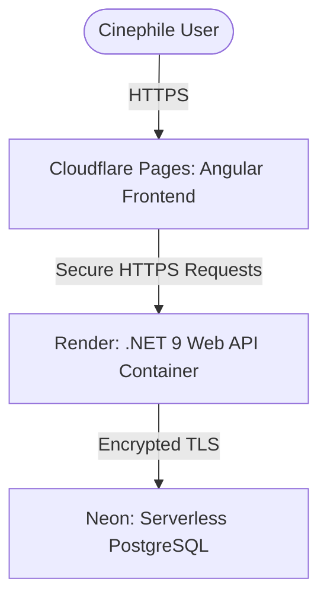

# Roadmap: Phase 8 (PaaS Cloud Deployment & CI/CD)

This phase details the architecture and step-by-step roadmap to deploy the Frametric platform (Neon PostgreSQL database, .NET 9 Web API on Render, and Angular 19+ frontend on Cloudflare Pages) using completely **free tiers** with git-based automatic deployments.

---

## 1. Deployment Architecture Overview



### The PaaS Free Tier Stack

| Component | Provider | Reason for Choice & Limits |
| :--- | :--- | :--- |
| **Relational Database** | **Neon** | Serverless Postgres database with 0.5 GB storage. Automatically scales to zero (sleeps) after 5-10 minutes of inactivity. Wakes up in ~1-2 seconds on the next query. |
| **Backend API** | **Render** | Free containerized Web Service (using Docker). Auto-sleeps after 15 minutes of inactivity (prevented via external Ping service). |
| **Frontend Client** | **Cloudflare Pages** | Static Web App hosting. Truly unlimited bandwidth on the free tier, global CDN edge, and zero cold starts. |
| **CI/CD Automation** | **GitHub Actions** | Built-in free build runs (2,000 minutes/month) to automate testing and build validations. |

---

## 2. Step 1: Database Setup (Neon)

Set up a production-ready serverless PostgreSQL instance.

### Action Plan

1. Register a free account on **Neon**.
2. Provision a new PostgreSQL 16/17 database instance in a region close to your target users.
3. Retrieve the connection string. For .NET EF Core, format the connection string:

   ```text
   Host=ep-cool-shadow-123456.us-east-2.aws.neon.tech;Database=neondb;Username=jeotma;Password=MySecurePassword;SSL Mode=Require;Trust Server Certificate=true;
   ```

4. Configure EF Core to run migrations against this connection string securely using environment variables.

---

## 3. Step 2: Backend Containerization & Render Deployment

To host the .NET 9 Web API on Render's free tier, we build a multi-stage Docker image.

### Dockerfile Setup

Create a production-grade `Dockerfile` in the repository root:

```dockerfile
# Frametric — Cinematic Analytics Platform
# Copyright (C) 2026 Jesús J. Otero Martínez <jesusoteromartinez@outlook.com>

FROM mcr.microsoft.com/dotnet/sdk:9.0 AS build-env
WORKDIR /app

# Copy csproj files and restore dependencies
COPY backend/*.sln ./backend/
COPY backend/Frametric.Domain/*.csproj ./backend/Frametric.Domain/
COPY backend/Frametric.Application/*.csproj ./backend/Frametric.Application/
COPY backend/Frametric.Infrastructure/*.csproj ./backend/Frametric.Infrastructure/
COPY backend/Frametric.Api/*.csproj ./backend/Frametric.Api/
RUN dotnet restore ./backend/Frametric.Api/Frametric.Api.csproj

# Copy everything else and build release
COPY backend/ ./backend/
RUN dotnet publish ./backend/Frametric.Api/Frametric.Api.csproj -c Release -o out

# Build runtime image
FROM mcr.microsoft.com/dotnet/aspnet:9.0
WORKDIR /app
COPY --from=build-env /app/out .

# Expose Render default port
EXPOSE 8080
ENV ASPNETCORE_URLS=http://+:8080

ENTRYPOINT ["dotnet", "Frametric.Api.dll"]
```

### Action Plan

1. Link your GitHub repository to **Render**.
2. Create a new **Web Service** and select **Docker** as the environment runtime.
3. Configure the following Environment Variables in Render's dashboard:
   - `ASPNETCORE_ENVIRONMENT`: `Production`
   - `ConnectionStrings__DefaultConnection`: *[Your Neon PostgreSQL Connection String]*
   - `Omdb__ApiKey`: *[Your OMDB API Key]*
   - `Tmdb__BearerToken`: *[Your TMDB token]*
   - `JwtSettings__Secret`: *[A long secure random string]*
   - `JwtSettings__Issuer`: `Frametric`
   - `JwtSettings__Audience`: `FrametricApp`
   - `JwtSettings__ExpiryMinutes`: `1440`
   - `SmtpSettings__Host`: `smtp.resend.com`
   - `SmtpSettings__Port`: `465`
   - `SmtpSettings__Username`: `resend`
   - `SmtpSettings__Password`: *[Your Resend API Key]*
   - `SmtpSettings__From`: `onboarding@resend.dev` *(or your verified Resend domain)*
4. Deploy the service. Render will automatically build the image and expose a public HTTPS URL (e.g. `https://frametric-api.onrender.com`).

---

## 4. Step 3: Prevent Render Sleep (UptimeRobot)

Because Frametric relies on background workers (Channels) to synchronize TMDB data, we must prevent Render's 15-minute inactivity sleep to ensure large imports complete successfully.

1. Create a free account on **UptimeRobot** (or cron-job.org).
2. Create a new HTTP Monitor.
3. Target the API Health endpoint: `https://frametric-api.onrender.com/api/v1/health`
4. Set the ping interval to **14 minutes**.

---

## 5. Step 4: Frontend Build & Cloudflare Pages Deployment

Deploy the Angular 19+ client as a lightning-fast Static Single Page Application (SPA).

### Configuration Adjustments

To prevent 404 errors when reloading subpages in a client-side routed Angular SPA, output a `_redirects` file into your `public/` directory so Angular copies it automatically during build:

1. Create a file `frontend/public/_redirects` with the following content:
```text
/* /index.html 200
```

### Action Plan

1. Configure `src/environments/environment.prod.ts` with the production URL of the API on Render:

   ```typescript
   export const environment = {
     production: true,
     apiUrl: 'https://frametric-api.onrender.com/api/v1'
   };
   ```

2. Connect your GitHub repository to **Cloudflare Pages**.
3. Set the build settings:
   - **Framework Preset**: `Angular`
   - **Build Command**: `npm run build -- --configuration production`
   - **Output Directory**: `dist/frametric/browser`
4. Trigger the build. Cloudflare Pages will serve the app under a secure domain (e.g., `https://frametric.pages.dev`).

---

## 6. Step 5: CORS Configuration & Security Settings

To allow the Cloudflare Pages frontend to communicate with the Render API, configure the CORS policy dynamically.

Ensure `backend/Frametric.Api/Program.cs` loads origins from an environment variable (e.g., `Cors__AllowedOrigins=https://frametric.pages.dev`).

```csharp
// Frametric — Cinematic Analytics Platform
// Copyright (C) 2026 Jesús J. Otero Martínez <jesusoteromartinez@outlook.com>

builder.Services.AddCors(options =>
{
    options.AddPolicy("ProductionCorsPolicy", policy =>
    {
        policy.WithOrigins("https://frametric.pages.dev") // Cloudflare Pages Domain
              .AllowAnyHeader()
              .AllowAnyMethod();
    });
});

// Inside HTTP Pipeline configuration:
app.UseCors("ProductionCorsPolicy");
```

---

## 7. Step 6: Database Migrations Automation

To automatically apply migrations on startup, configure the application entrypoint to run migrations at launch:

```csharp
// Frametric — Cinematic Analytics Platform
// Copyright (C) 2026 Jesús J. Otero Martínez <jesusoteromartinez@outlook.com>

using (var scope = app.Services.CreateScope())
{
    var services = scope.ServiceProvider;
    try
    {
        var context = services.GetRequiredService<FrametricDbContext>();
        if (context.Database.IsRelational())
        {
            await context.Database.MigrateAsync();
        }
    }
    catch (Exception ex)
    {
        var logger = services.GetRequiredService<ILogger<Program>>();
        logger.LogError(ex, "An error occurred while migrating the database.");
    }
}
```
